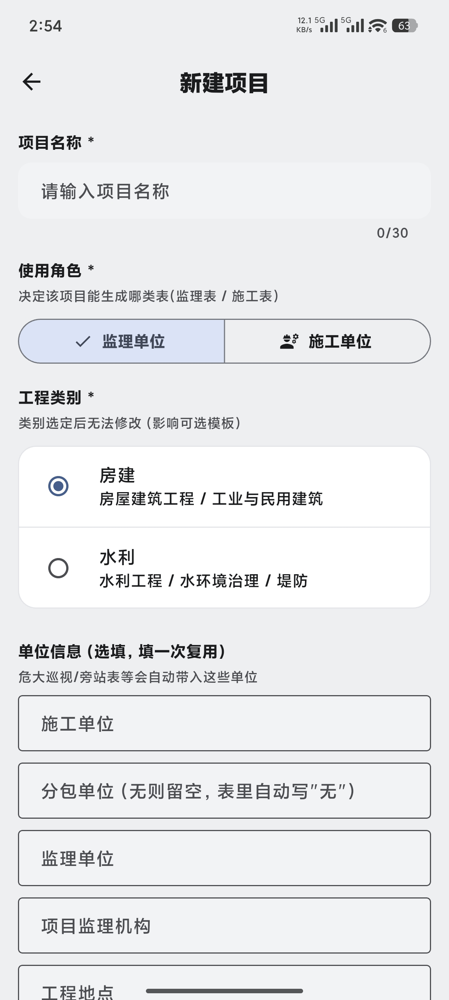
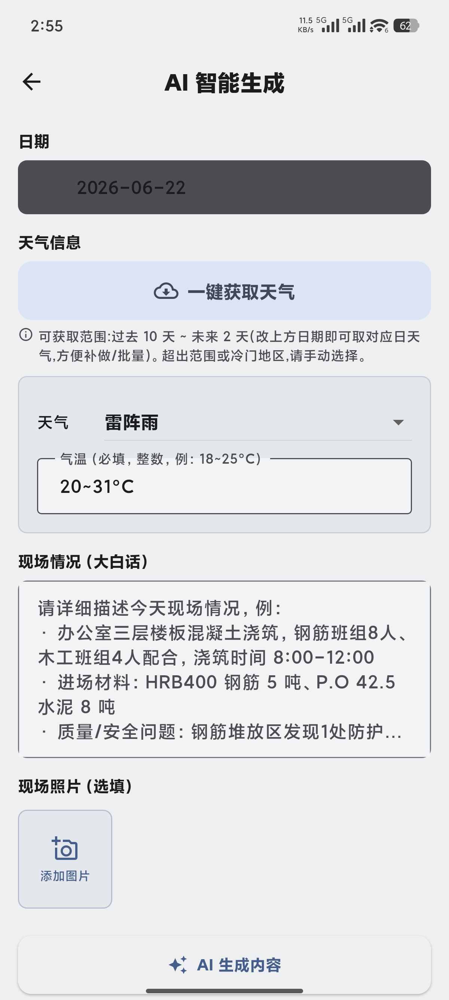
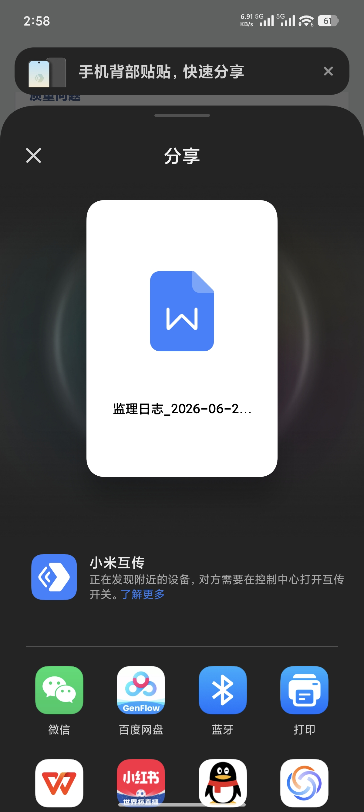
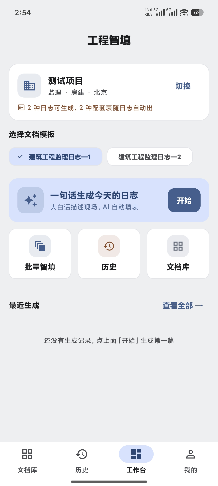
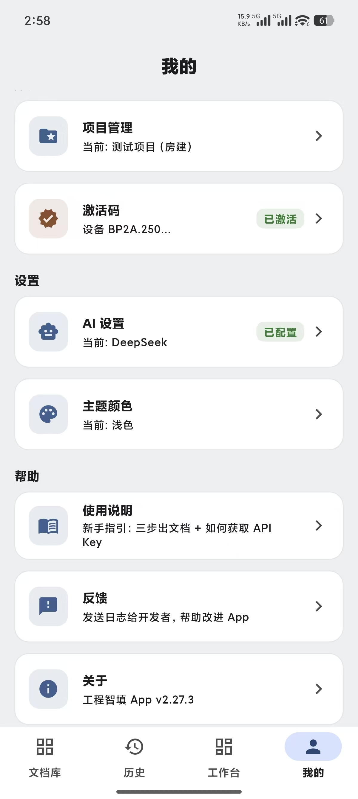
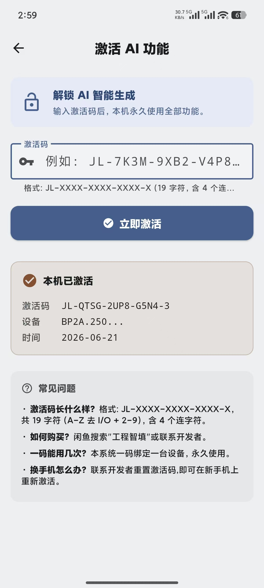

# 工程智填

**一段大白话 → AI 自动填好工程表格**

房建/水利 监理日志 · 危大配套表 · 材料台账 · 施工日报 · 施工单位周报

[📥 下载 Android 版](https://github.com/xiaoxijin199307081491-a11y/gongcheng-zhitian-release/releases/latest) · [🌐 官方网站](https://xiaoxijin199307081491-a11y.github.io/gongcheng-zhitian-release/) · [它能做什么](#它能做什么)

---

## 为什么会做这个

工程现场每天要填大量格式固定、措辞套路化的表格——监理日志、危大巡视/旁站、施工日报、验收记录……手写一份要十几分钟、还容易漏项不规范。

于是自己写了一个。**一段大白话 → AI 按国标规范和填表套路把整张表 17~24 个字段补全**,连质量检查、安全隐患、危大配套表都自动联动生成。忘了写、要补一整段时间的日志,也能一段话批量补做;材料进场后还能自动汇总成台账,**送检报告回没回都一清二楚**。就这些。

---

## 它能做什么

### 📝 一句话生成日志
- 监理日志(房建通用/精简版、水利)、施工日报、施工单位周报——已就绪
- **混搭**:手动填写 + AI 智能生成(LLM 推理 + 真实知识库校验),按需选
- 一键导出 Word(原生 docx,支持现场照片双排布局)

### 🛡️ 防幻觉
- 真实 GB 验收规范知识库 + 后置校验
- **严禁编造用户没提到的楼层/人数/班组/原因/状态**
- 质量检查/安全隐患/建筑垃圾 3 行强制推导(精确联动)
- 6 项强制默认值兜底

### ⚠️ 危大配套表自动触发
- 常规危大→巡视检查记录表,超规模→旁站检查记录表
- 与日志**同段话同步生成**,不用单独填
- 触发器现成(深基坑/高支模/脚手架/起重吊装/爆破/人工挖孔桩…)

### 📋 材料进场 / 见证取样台账
- 日志记了"XX材料进场,见证取样"→ **AI 自动开行**(台账=材料信息唯一真相源)
- 双向同步:台账改了**反向回写**当天日志的材料/见证栏
- 那天没日志 → 弹窗引导去补(材料预填)
- 标记送检状态(未送检/已送检待回/报告已回/免检)+ 报告编号
- 一键导出 Excel

### 🕒 批量智填
- 选一段日期 + 一段大白话,AI 规划铺到每一天
- 每人/每班组分配合理(可推测)
- 但**工序/部位/材料数量必须来自用户**——严禁编造
- 停工天、点名天、未点名天自动识别
- 危大表 / 天气 / 照片同步处理

### ☁️ 一键获取天气
- 按项目「工程地点」自动取和风天气(过去 10 天 ~ 未来 2 天)
- **不用 GPS**
- 批量补做时按日取真天气,取不到才退代表天气

### 🎨 主题 & 国际化
- Material 3 单一种子色(专业蓝)
- 跟随系统 / 浅色 / 深色
- 中文国际化(DateRangePicker zh_CN)
- 工作台"飞书风"常用宫格(按角色×类别动态),文档库全量分类浏览

### 🔒 付费 / 激活码
- 一码一设备,服务端可撤销
- 三态管理(已激活 / 24h 离线警告 / 已过期)
- 激活门控覆盖所有付费功能(AI 生成 / 台账 / 高级导出)

---

## 📥 下载与安装

**Android**:[点此下载最新版 APK](https://github.com/xiaoxijin199307081491-a11y/gongcheng-zhitian-release/releases/latest) → 打开安装,如提示「未知来源 / 外部来源」选择允许即可。

**iOS**:正在适配中,受 App Store 上架审核流程影响暂未开放,上线后会第一时间在此发布。

> 付费软件:安装后需激活码解锁全部功能(AI 生成 / 台账 / 高级导出)。如需激活码请联系作者。

## 怎么使用

| ① 建项目 | ② 一句话生成 | ③ 核对导出 |
|:---:|:---:|:---:|
|  |  |  |
| 选**角色**(监理/施工)+ **工程类别**(房建/水利),填工程地点 | 填日期、天气(可一键获取)、一段大白话,点「AI 生成内容」 | 核对后一键导出 Word,微信/蓝牙分享 |

## 界面预览

| 工作台 | 我的 | 激活码 |
|:---:|:---:|:---:|
|  |  |  |

---

## 许可

闭源商业付费软件。本仓库仅用于发布安装包与项目说明,不含源码。版权归作者所有,未经许可不得复制、二次分发或商用。

---

## 致谢

- [Flutter](https://flutter.dev) — 一份代码,Android + iOS
- [腾讯云 CloudBase](https://cloud.tencent.com/product/tcb) — 激活码 / 反馈 / 监控 / 天气代理,全栈国内服务
- [和风天气](https://www.qweather.com) — 历史+预报天气 API
